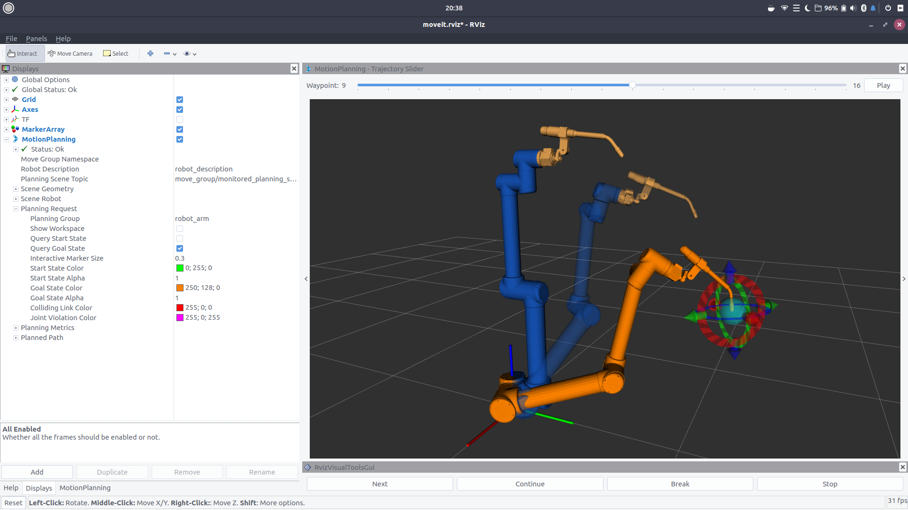

# Arm-Ageddon

This work was developed with the recommended version (2020) ROS1 Melodic Morenia for Linux Ubuntu Budgie 18.04 LTS distribution, and compiled with the catkin-tools extension (catkin build). It is worth noting that the last version of ROS1 will be Noetic Ninjemys, but it is currently in the beta phase. There is also the Moveit 2 project for ROS2, but it is still in the migration process.

🎬 [Overview - Video](documentos/videos/OverView.mp4)

📚 [Descrição completa do projeto](TCC_Paulo_Victor_Duarte.pdf)

🎓 [Link do Repositório (UFSC)](https://repositorio.ufsc.br/handle/123456789/218307)



# A. Software Requirements

1. Ubuntu Budgie 18.04 LTS
2. ROS Melodic Morenia
3. MoveIt

# B. Installation

In another repository of my authorship, you can find a bash-script to install Moveit on an Ubuntu 18.04 LTS.

Follow the steps described in: [BashScript-RosMoveit](https://github.com/paulovictor237/BashScript-RosMoveit)

# C. Applications

Here is the description of the 5 implemented applications.

**1. GoRandom**

The objective of this application is to create a short and simple code that only performs a random movement. Since the point is usually far from the robot's current position, this creates two problems: the standard time for MoveIt to calculate the trajectory is insufficient and the path is unpredictable. To improve the frequency with which this program finds a successful trajectory, the standard time of 5 seconds was increased to 10, and the trajectory planning algorithm was forced to run with RRT to ensure that a trajectory is found, even if it is not the ideal one.

**2. GoHome**

The GoHome application forces all robot joints to the zero value, regardless of where it is. This code also serves as a demonstration of the types of messages that ROS can emit, and prints on the screen various information about the robot extracted from the MoveGroupInterface class methods themselves.

**3. GoTypeMoves**

TypeMoves is a demonstration of the movement methods that MoveGroupInterface has. The application performs the following tasks.

- Plan and execute trajectory for any point;
- Plan and execute trajectory by inserting joint values;
- Plan and execute linear trajectories in a Cartesian Plane

In this practice, it was necessary to convert the Roll Pitch Yall orientation into Quaternions before assigning values to the robot.

The code also uses the "MoveItVisualTools" class to present messages and draw trajectories in Rviz.

**4. CartesianReader**

The CartesianReader program uses the CartesianPath function implemented by the MoveGroupInterface class, already presented in the TypeMoves application. This function takes as input a vector of points and plans the trajectory with linear movements. Other initialization parameters for the function listed below.

- Maximum Velocity and Acceleration;
- Maximum time for inverse kinematics calculation;
- Step size, in meters, between trajectory points;
- Activate or deactivate the routine that avoids collisions with environment objects when planning the trajectory.

The parameters and set of points to be passed to the function are declared in a markdown file with the extension ".md" present in the directories of the armageddon_robot package. The program reads the file **[positions.md](armageddon_robot/arquivos/positions.md)** and creates the trajectory planning between the points. The parameters of this function are described in the file **[CartesianReader.md](documentos/formulario/CartesianReader.md)**.

**5. StopMove**

The last developed application is StopMove. The program suspends any movement of the robot regardless of the application in operation.

The program creates a topic called "/armageddon/stop_robot", which waits for a message with the word "STOP" to execute the call of the function "MoveGroupInterface::stop".

The creation of a planning group is only allowed in the main. However, the construction of a topic is through a thread, which makes it difficult to pass variables from the main as a parameter. The solution was to create a class-thread, in which the attributes have a pointer that receives the planning group created in the main by reference.

The roscpp is responsible for performing the callback whenever a new message arrives at the topic, thus, the reading frequency will always be synchronous with the publication rate on the topic. In other words, it is expected that the topic receives the message immediately after it is published, considering the computer processing rate.

By default, rostopic pub publishes a message to the topic and remains blocked until the user forces the program interruption by pressing ctrl-c. However, it is possible to pass the value "-1" as an argument to this function as shown below, so rostopic will keep the message locked for 3 seconds and automatically terminate the publication.

```shell
rostopic pub -1 /armageddon/stop_robot std_msgs/String "data: 'STOP'"
```

# D. Execution

Open two terminals and run the following codes. You can uncomment **`use_gui:=true`** if you want to control the motors with a graphical interface.

> Terminal 1

```shell
roslaunch armageddon_moveit demo.launch #use_gui:=true
```

In the second terminal, run one of the applications below:

> Terminal 2

```shell
rosrun armageddon_robot GoRandom
rosrun armageddon_robot GoHome
rosrun armageddon_robot GoTypeMoves
rosrun armageddon_robot CartesianReader
rosrun armageddon_robot StopMove
```

# E. ROS GUI

rqt has a complete arsenal of graphical tools that facilitate the understanding of the abstraction of the lines of code. One of the most interesting is **rqt_graph**. It is possible to map the relationship between MoveIt topics and applications.

```shell
rosrun rqt_graph rqt_graph
```

# F. Capturing points by the simulator

To map the points used in the CartesianReader application, it is desired that the points are within the robot's workspace. A simple and fast way to obtain the position and orientation of the robot within its workspace can be done through "Motion Planning". The idea is to move the robot with this tool and obtain the TCP location through the _Feedback_ topic. The topic information can also be viewed with the rqt graphical interface.

```shell
 rosrun rqt_topic rqt_topic

```

```shell
rostopic echo -c /rviz_moveit_motion_planning_display/robot_interaction_interactive_marker_topic/feedback
```

# Extra

Inside the project directories, there are also images and videos to be explored.

- [Vídeos](documentos/videos)

- [Imagens](documentos/imagens)

## License

Copyright (C) 2020 Paulo Victor , All rights reserved.

**Free Software, Hell Yeah!**
